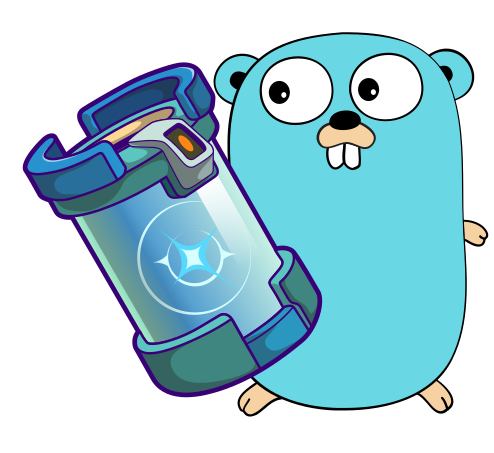

# go-codegen

Generate Go code for your CosmWasm smart contracts.

<p align="center">
  
</p>

<div align="center">

  [](https://github.com/srdtrk/go-codegen/tree/main/integration_test)
  [](https://github.com/srdtrk/go-codegen/releases/latest)
  [](https://github.com/srdtrk/go-codegen/blob/main/LICENSE)
  [](https://github.com/srdtrk/go-codegen)
</div>

```
go install github.com/srdtrk/go-codegen
```

The quickest way to generate Go code for your CosmWasm smart contracts. Currently, this tool only supports generating the types needed to interact
with the smart contract. Support for a gRPC query client and a gRPC transaction client is planned.

## Usage

In order to generate Go code for your CosmWasm smart contract, you need to have its full API exported as a JSON file
using [`cosmwasm-schema`](https://crates.io/crates/cosmwasm-schema).
Once you have the JSON file, you can use it to generate the Go code.

```sh
go-codegen generate /path/to/contract-api.json --output /path/to/output --package-name mypackage
```

This will generate the Go code in the specified optional output directory, if not specified, it will generate the code in `output.go` in the current directory.
Package name is also optional, if not specified, it will use the name of the contract.
<<<<<<< HEAD

## Acknowledgements

The Go Gopher mascot was created by [Renee French](https://reneefrench.blogspot.com/) and is licensed under the [Creative Commons 4.0 Attribution License](https://creativecommons.org/licenses/by/4.0/).
I've modified the original image to include the logo of [`ts-codegen`](https://github.com/CosmWasm/ts-codegen).
