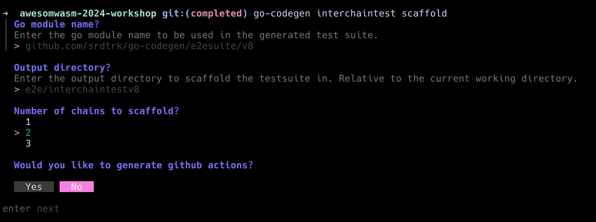

import HighlightBox from '@site/src/components/HighlightBox';
import CodeBlock from '@theme/CodeBlock';

# Scaffold a Test Suite with go-codegen

In go-codegen, a test suite is a go project that contains test cases for an application. The test suite is independent of the application and contracts can be added to the test suite independently. This allows for testing multiple contracts in a single test suite.

To scaffold the test suite, run the following command:

<CodeBlock source="https://github.com/srdtrk/awesomwasm-2024-workshop/commit/aaf977f390960514702f81c3c88a8754f26c57f5">
    {`go-codegen interchaintest scaffold`}
</CodeBlock>

This command will open an interactive prompt that will guide you through the process of creating a test suite. The prompt will ask you to provide the following information:



- **Go Module Name**: The name of the Go module for the test suite.
- **Output Directory**: The directory where the test suite will be created.
- **Number of Chains to Scaffold**: The number of chains to scaffold in the test suite.
- **Github Actions**: Whether to scaffold Github Actions for the test suite.

For this tutorial, we use the default values with github actions enabled.

<HighlightBox type="note" title="Note">

The go module name doesn't matter as it is not published to the Go module registry. It is only required to be a valid Go module name.

</HighlightBox>

The generated test suite will contain the following files and directories:

```text
e2e/interchaintestv8
├── README.md
├── basic_test.go
├── chainconfig
│   ├── chain_config.go
│   ├── encoding.go
│   └── genesis.go
├── e2esuite
│   ├── constants.go
│   ├── diagnostics.go
│   ├── grpc_query.go
│   ├── suite.go
│   └── utils.go
├── go.mod
├── go.sum
├── testvalues
│   └── values.go
└── types
    └── contract.go
.github
└── workflows
    └── e2e.yml

7 directories, 15 files
```

The test suite comes with a `basic_test.go` which you can run already without any contracts. You can test this by running:

```sh
cd e2e/interchaintestv8
go test -v . -run=TestWithBasicTestSuite/TestBasic
```

The testsuite contains 4 go packages:

- `chainconfig`: Contains the chain configuration for the test suite. Currently, the only autogenerated chain is `wasmd` v0.50.0
- `e2esuite`: Contains the core components of the testsuite, such as setting up chains, relayer, and important utility functions.
- `testvalues`: Contains the test value constants for the test suite.
- `types`: Contains the contract types for the test suite. We will populate this directory with the contract types for the contracts we want to test.
- `basic_test.go`: Contains a basic test suite that can be run without any contracts.

<HighlightBox type="tip" title="Exploration">

Take some time to explore the test suite and `basic_test.go`. A good exercise is to bump the version of the `wasmd` chain to `v0.51.0` which uses CosmWasm v2, and see how the test suite behaves.

To test github actions, you can open a pull request to your forked repository and see the actions run.

</HighlightBox>

<HighlightBox type="reading" title="More Chains">

Although currently the test suite only contains the `wasmd` image, you can change the chain configuration manually. We want to have options to scaffold additional chains in the future.

For example, the following repositories contain the chain configurations for other chains while still using the same test suite:

- [ibc-go-simd](https://github.com/srdtrk/cw-ica-controller/blob/d6b033092071e37f2dd015b58810a02257a92b6b/e2e/interchaintestv8/chainconfig/chain_config.go#L34-L55)
- [osmosis](https://github.com/chelofinance/cw-icq-controller/blob/3540483852bc0de8f0166b675d2573c5571b80e1/e2e/interchaintest/chainconfig/chain_config.go#L85-L109)

</HighlightBox>
